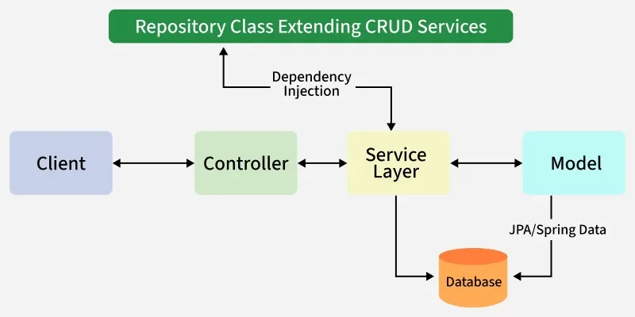

---

# 📝 Spring Boot – Introduction (Quick Notes)

---

## 🔹 What is Spring Boot?

**Spring Boot** is a framework built on top of **Spring Framework** that simplifies Java application development by providing **auto-configuration, embedded servers, and minimal setup**.

👉 Goal: *Build production-ready applications quickly with less configuration.*

---

## 🔹 Difference: Spring Framework vs Spring Boot

| Feature           | Spring Framework      | Spring Boot          |
|-------------------|-----------------------|----------------------|
| Configuration     | Manual (XML/Java)     | Auto-configured      |
| Setup Time        | High                  | Low                  |
| Server            | External (deploy WAR) | Embedded server      |
| Dependencies      | Managed manually      | Starter dependencies |
| Development Speed | Slower                | Faster               |

---

## 🔹 Why Spring Boot is Used?

* Reduces boilerplate code
* Eliminates XML configuration
* Faster development
* Easy to build REST APIs
* Standalone applications (no external server needed)

## 🔹 Spring Boot Architecture

1. **Client Layer**
   >This represents the external system or user that interacts with the application by sending HTTPS requests.
2. **Controller Layer (Presentation Layer)**
   >Handles incoming HTTP requests from the client.
   Processes the request and sends a response.
   Delegates business logic processing to the Service Layer.
3. **Service Layer (Business Logic Layer)**
   >Contains business logic and service classes.
   Communicates with the Repository Layer to fetch or update data.
   Uses Dependency Injection to get required repository services.
4. **Repository Layer (Data Access Layer)**
   >Handles CRUD (Create, Read, Update, Delete) operations on the database.
   Extends Spring Data JPA or other persistence mechanisms.
5. **Model Layer (Entity Layer)**
   >Represents database entities and domain models.
   Maps to tables in the database using JPA/Spring Data.
6. **Database Layer**
   >The actual database that stores application data.
   Spring Boot interacts with it through JPA/Spring Data.

---

## 🔹 Request Flow in Spring Boot




> Client ->Controller ->Service ->Repository ->Database ->Response
>
* A Client makes an HTTPS request (GET/POST/PUT/DELETE).
* The request is handled by the Controller, which is mapped to the corresponding route.
* If business logic is required, the Controller calls the Service Layer.
* The Service Layer processes the logic and interacts with the Repository Layer to retrieve or modify data in the Database.
* The data is mapped using JPA with the corresponding Model/Entity class.
* The response is sent back to the client. If using Spring MVC with JSP, a JSP page may be returned as the response if no errors occur.

---

## 🔹 Key Features

---

### ✅ 1. Auto-Configuration

* Automatically configures beans based on:

    * Dependencies
    * Properties
    * Classpath

👉 Example: If DB dependency is present → DataSource auto-created

---

### ✅ 2. Starter Dependencies

* Predefined dependency bundles

Examples:

* `spring-boot-starter-web`
* `spring-boot-starter-data-jpa`

👉 No need to manage multiple dependencies manually

---

### ✅ 3. Embedded Server

* No need to deploy WAR file externally
* Runs application directly

Example:

* **Apache Tomcat**

👉 Start app using:

```bash
mvn spring-boot:run
```
### ✅ 4. How do you replace Tomcat with Jetty in Spring Boot?

Answer:
> Exclude spring-boot-starter-tomcat from spring-boot-starter-web and add spring-boot-starter-jetty dependency.

```xml
<!-- Web (exclude Tomcat) -->
<dependency>
  <groupId>org.springframework.boot</groupId>
  <artifactId>spring-boot-starter-web</artifactId>
  <exclusions>
    <exclusion>
      <groupId>org.springframework.boot</groupId>
      <artifactId>spring-boot-starter-tomcat</artifactId>
    </exclusion>
  </exclusions>
</dependency>

<!-- Jetty -->
<dependency>
<groupId>org.springframework.boot</groupId>
<artifactId>spring-boot-starter-jetty</artifactId>
</dependency>
```


---

## 🔹 Project Structure Overview

> tree /F

```text
src/main/java
    └── Main class (@SpringBootApplication)

src/main/resources
    ├── application.properties
    ├── static/
    └── templates/

src/test/java
```

---

## 🎯 Interview Questions (Basic → Moderate)

### 🟢 Basic

1. What is Spring Boot?
2. Why do we use Spring Boot instead of Spring?
3. What are the main features of Spring Boot?
4. What is embedded server in Spring Boot?

---

### 🟡 Moderate

5. What is auto-configuration? How does it work?
6. What is `@SpringBootApplication` annotation?
7. What are starter dependencies?
8. How does Spring Boot reduce boilerplate code?

---

### 🔴 Tricky

9. Can we disable auto-configuration? How?
10. What happens internally when you run a Spring Boot application?

